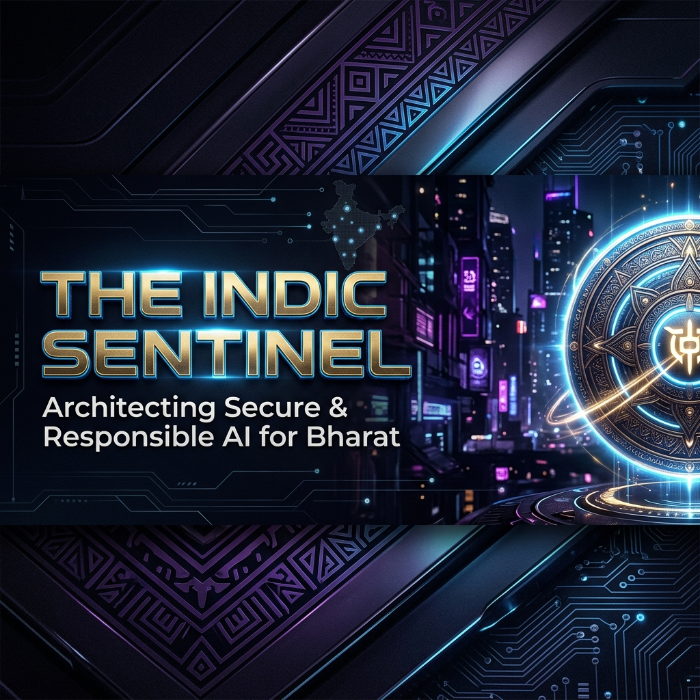
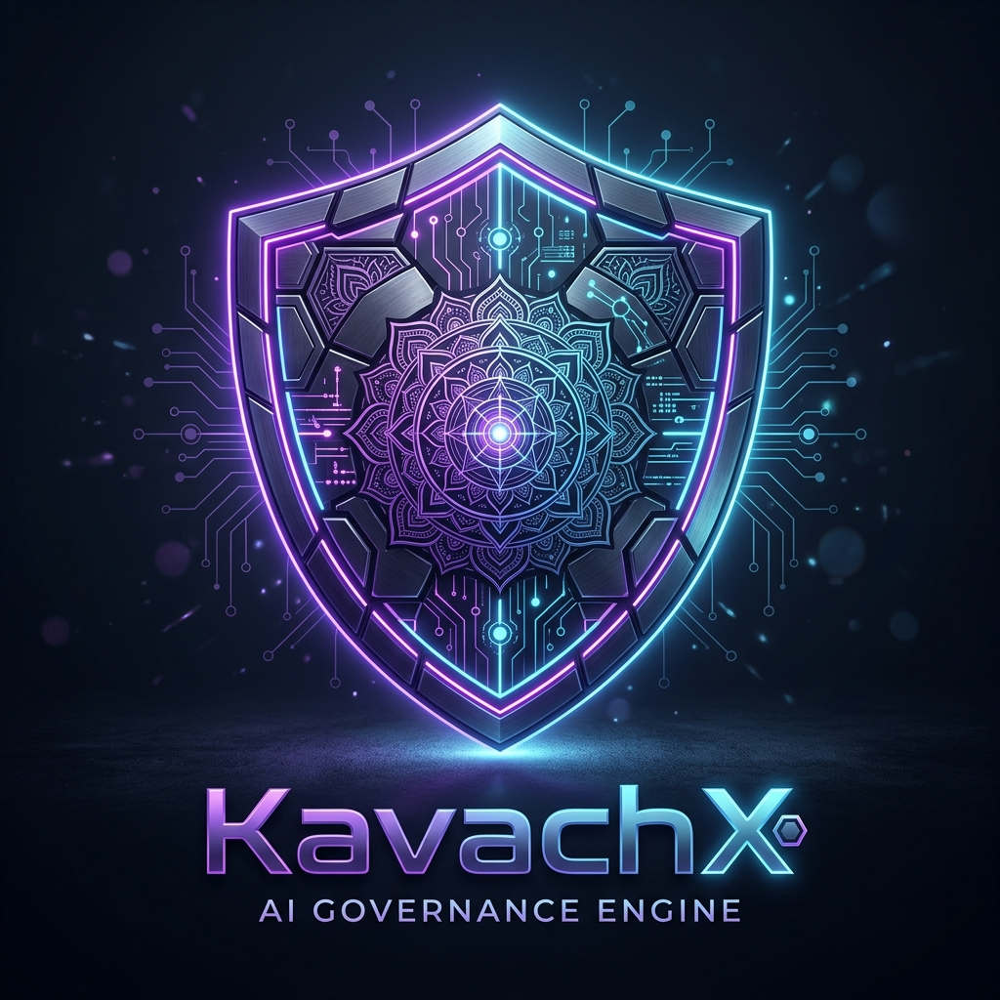

<p align="center">
  
</p>

<br/>

<div align="center">

# 🛡️ Architecting the Future of Responsible AI in Bharat

[](https://git.io/typing-svg)

<br/>


&nbsp;
[](https://github.com/nerd1412?tab=followers)

</div>

---

## 🏛️ The Vision: Digital Armor for an AI-First Nation

I am an **AI/ML Engineer & Full-Stack Architect** based in **India 🇮🇳**, dedicated to building the essential trust layer that AI systems in Bharat require to move from prototype to production.

In a rapidly digitizing economy, AI governance isn't just a hurdle — it's the foundation of trust. My work focuses on creating **Digital Armor** for enterprise AI, ensuring that as systems proliferate across **Fintech, Healthcare, HR, Education, and Public Infrastructure**, they remain secure, fair, and perfectly aligned with the digital laws of the land.

### 🛡️ KavachX: The Enforcement Layer
My flagship project, **KavachX**, is a production-grade AI governance engine. It acts as a real-time policy firewall between AI models and users, enforcing **baseline policies following all applicable AI-related and digital laws in Bharat** at the speed of inference.

- 🔍 **Real-Time Security Architecture:** Every interaction is intercepted, analyzed, and scored across composite risk dimensions before a single token reaches the user.
- 🧬 **ML-Native Safety Engine:** Moving beyond simple keyword filters to custom-trained safety classifiers that understand context, intent, and domain-specific nuances.
- 🔒 **Enterprise-Grade Observability:** Providing an immutable audit trail and a live executive dashboard for stakeholders to monitor compliance health across the entire model lifecycle.
- 🌐 **Ubiquitous Governance:** From headless API middleware to browser-level interception via Chrome Extensions, KavachX ensures that governance is integrated, not added.

> *I am currently operationalizing several differentiated, market-first security capabilities in stealth, focusing on hardening general AI safety and deep alignment with Bharat's emerging digital public infrastructure standards.*

---

## 🚀 Featured Projects

<table border="0">
<tr>
<td width="50%" valign="top">

### 🛡️ [KavachX — AI Governance Engine](https://github.com/TheIndicSentinel/kavachxv2)
> *The enforcement layer for production AI*

<p align="center">
  
</p>

A **real-time governance platform** acting as the middle-layer for AI interactions. Implements composite risk scoring and immutable audit logging.

**Highlights:**
- ⚡ Real-time inference risk scoring
- 🔒 Bharat-native compliance engine
- 🧬 Custom-trained ML classifiers
- 🧩 Browser-layer AI interception


</td>
<td width="50%" valign="top">

### 💪 [Mpower Fitness Platform](https://github.com/TheIndicSentinel/mpowerfitness)
> *SaaS for the fitness economy*

<p align="center">
  
</p>

A **multi-role fitness SaaS** with real-time trainer-client management, analytics, and indigenous payment integrations.

**Highlights:**
- 💬 Real-time chat via Socket.IO
- 📊 Complex analytics & streak tracking
- 💳 UPI deep-link payment ecosystem
- 🏋️ Scalable Node/PostgreSQL back-end


</td>
</tr>
<tr>
<td width="50%" valign="top">

### 🤖 [PO CoPilot — AI Procurement](https://github.com/TheIndicSentinel/PO-Copilot)
> *AI Assistant for enterprise flows*

A **Streamlit-based assistant** for procurement validation and change impact analysis, aligned with SAP BTP patterns.

**Highlights:**
- 🔍 Multi-field PO validation logic
- 📋 Approval summary automation
- ☁️ SAP BTP-aligned architecture


</td>
<td width="50%" valign="top">

### 🛒 [VyaparGPT — SME Intelligence](https://github.com/TheIndicSentinel/vyapar_gpt)
> *BI for the Bharat SME market*

An **LLM-powered assistant** enabling Indian traders to query business data using natural language in Hindi and English.

**Highlights:**
- 🗣️ Bilingual business intelligence
- 📈 AI-driven sales & inventory insights
- 🇮🇳 Tailored for SME traders


</td>
</tr>
</table>

---

## 📈 Growth Strategy: Path to a Top-Tier Architect Profile

### 1. 🏗️ High-Impact Projects (Proposed Roadmap)
To strengthen your profile's niche in AI Safety and Bharat-tech:
- **Bhasha-Shield:** A high-speed safety filter for Indian languages (Indic-NLP) to detect prompt injection in local dialects.
- **Privacy-Connect:** A lightweight SDK to bridge LLM agents with India Stack (Account Aggregator / ONDC) in a privacy-preserving way.
- **Governance-as-Code:** Building a Terraform provider for AI safety policies to automate compliance across varied cloud environments.

### 2. 📊 Improving Stats & Authority
- **Micro-Utility Focus:** Publish 3-5 small but sharp Python/NPM packages (e.g., a simple DPDPA data-masking tool). These attract stars and "Used By" tags faster than large monorepos.
- **Open Source Contributions:** Aim for 2-3 meaningful PRs to major safety frameworks like LangChain, LlamaIndex, or Microsoft’s Presidio.
- **Technical Storytelling:** Link your GitHub to a technical blog (Hashnode/Medium) where you explain the *engineering logic* behind KavachX.

---

## 📊 GitHub Stats

<div align="center">
<table border="0">
  <tr>
    <td align="center"></td>
    <td align="center"></td>
  </tr>
</table>

</div>

---

## 🛠️ Tech Stack

<div align="center">


</div>

---

## 🏆 GitHub Achievements

<div align="center">
  
</div>

---

## 💬 Current Sprint

```python
class TheIndicSentinel:
    def __init__(self):
        self.focus       = "AI Governance & Responsible ML"
        self.mission     = "Building Bharat's Digital Armor for AI"
        self.baseline    = "Applicable AI and Digital Laws in Bharat"
        self.stack       = ["Python", "FastAPI", "React", "PyTorch", "Docker"]
        self.status      = "Overhauling profile with elite branding & roadmap"

    def current_tasks(self):
        return [
            "🛡️ Finalizing premium branding and architecture roadmap",
            "🧬 Training domain-specific safety classifiers",
            "🛡️ Hardening real-time enforcement middleware",
            "📊 Designing executive compliance observability",
        ]
```

---

<div align="center">

*"In the age of AI, the question is not just what machines can do — but what they **should** do."*

⭐ **Star my repos if you find them useful!**

</div>
